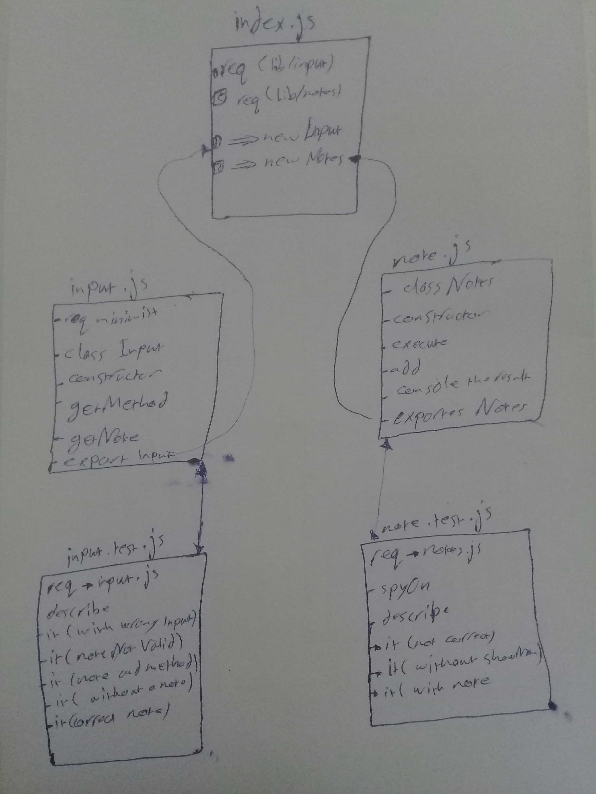

# LAB - Class 02

## Project: note

### Author: Hammad Ali

### Links and Resources

### Modules
#### `input.js`
### `notes.js`

### Setup

#### How to initialize/run your application 

- `node index.js -a 'showNote'`

#### How to use your library 
#### Tests
- Lint test: `npm run lint`

#### UML

